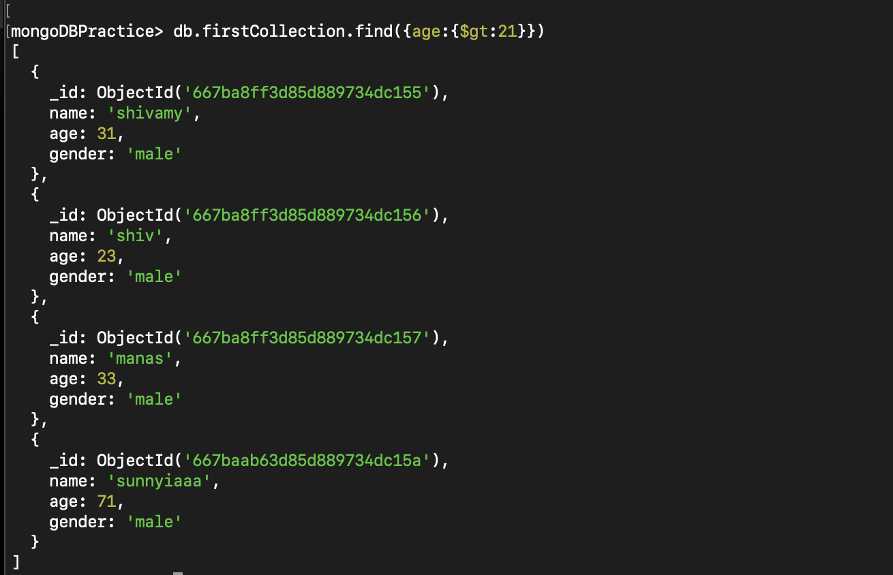
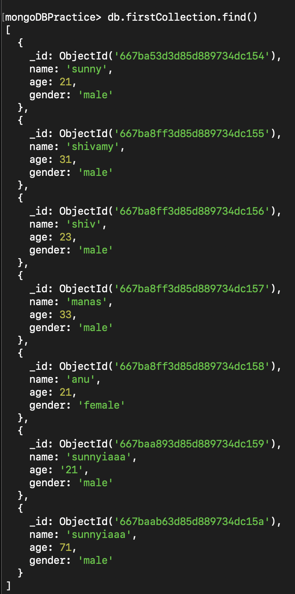
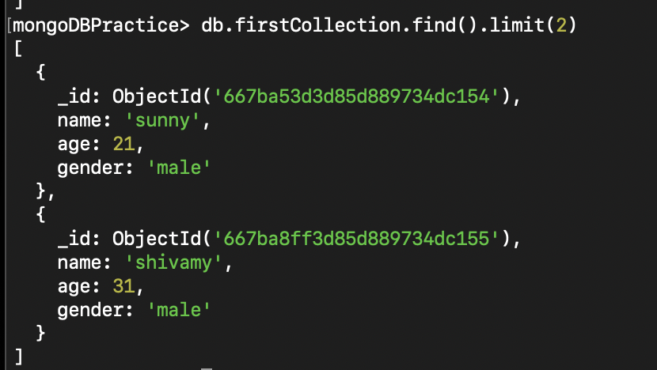
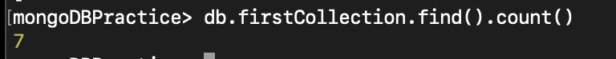
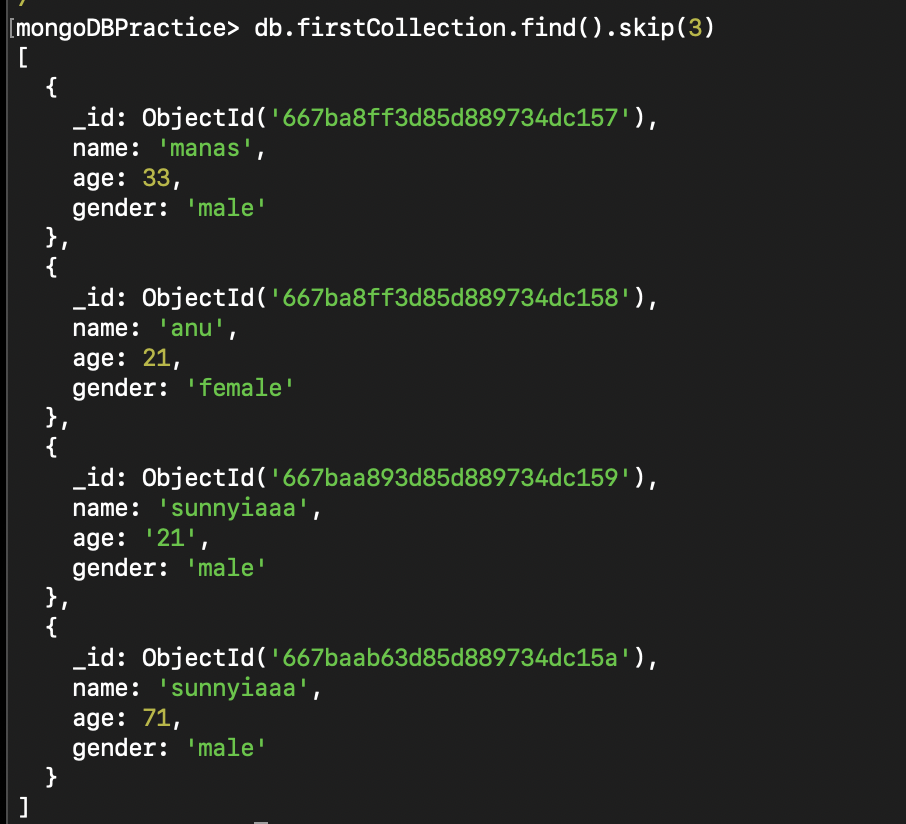
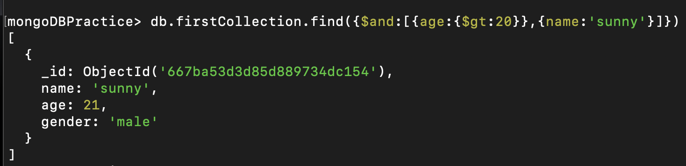
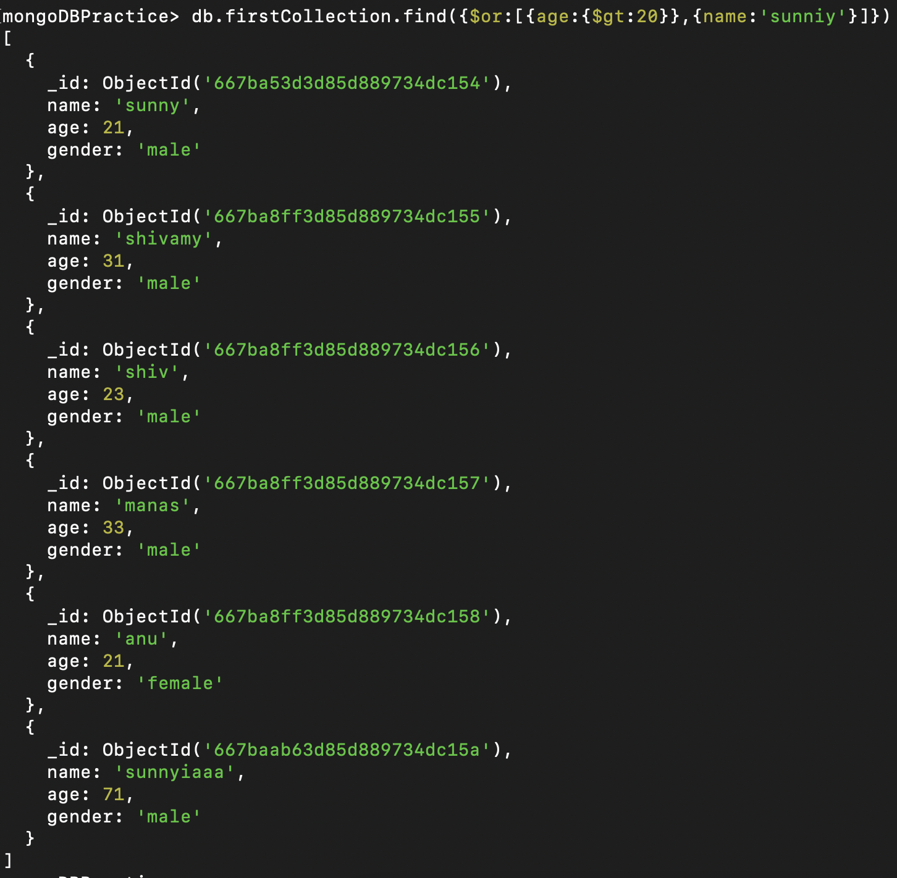
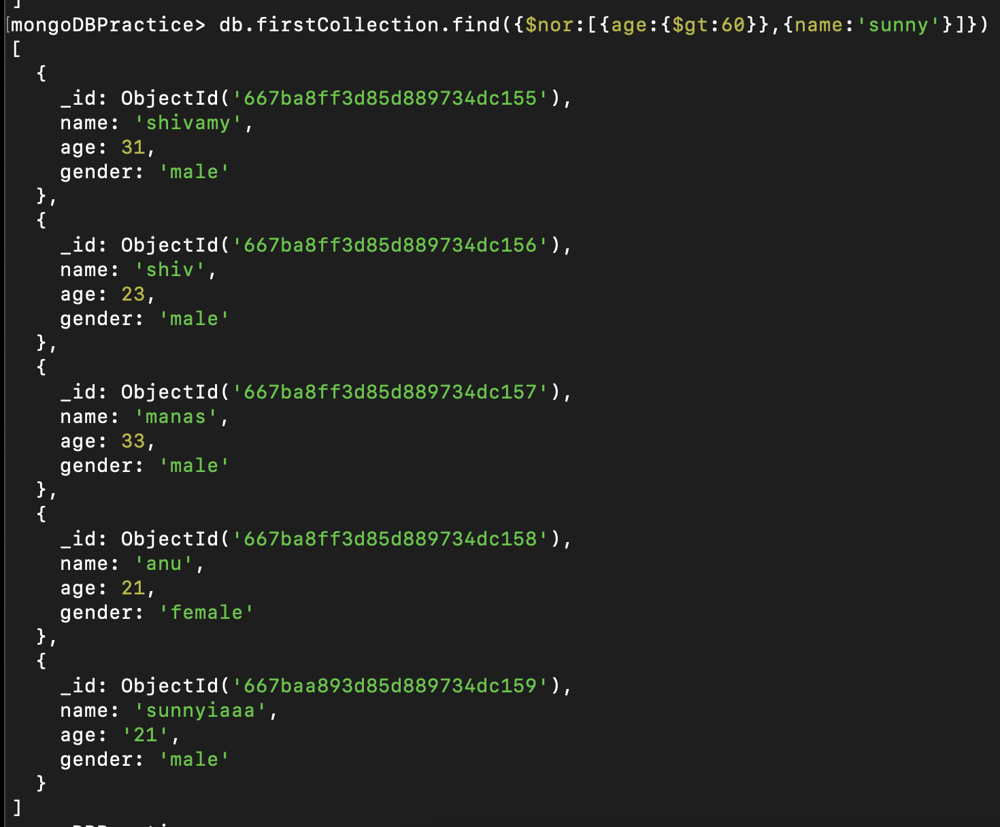
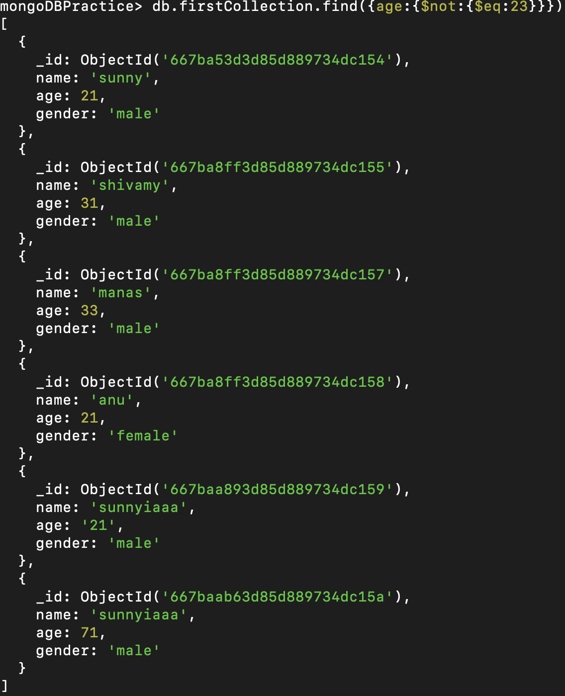

# MongoDB community server:

If you are using the windows system then the mongoDB community server is already started when the mongodb community is installed but if you are a mac user then you need to start the mongoDB community server using the command.

```bash
brew services start mongodb-community
```

then Start the mongoDB shell using :

```bash
mongosh
```

Start interacting with the following commands:

```bash
show dbs  //to show all the data base

use "db-name" //to create a new DB or move to a db

show collections //to show the collections of a DB

db.createCollection("name") //to create a new collection in DB

db.name.drop() //to delete the drop thing

db.dropDatabase() //to delete the DB
```

- you will see the DB in the list of the output of the show dbs command until the db has atleast one collection or insert any document into the Db a collection is automatically created.

## Below is the example of the above:


## CRUD OPERATION IN DB

## - Inserting Documents in MongoDB:

1. To Insert one document
   db.`<collection-name>.insertOne({field1:value1,field2:value2 })`

   
2. To Insert more than one document :
   db.`<collection-name>.insertMany([ {.....}, {......}]) `

   

## - Reading Document in MongoDB:

For retriving information from the mongoDB we use find method from.


# *Operators in MongoDB*

## Comparision Operator in MongoDB:

1. $eq - equal to
2. $ne - not equal to
3. $gt - greater than
4. $gte - greater than equal to
5. $lt - less than
6. $lte - less than equal to
7. $in - include
8. $ni - not include

all the above operator are used to retrieve information from your database and below is the syntax for that.

```
db.<collection-name>.find({'fieldname':{op:vale}})
```

Here is the example of that:



## Introduction to cursors:

In MongoDB, a cursor is an object that allows you to iterate over the result set of a query. It provides various methods to traverse, manipulate, and control the query results.


1. count
2. limit
3. sort
4. skip

For example lets fetch all the document from the DB.




Now use the above methods:









## Logical Operator

we have four logical  operator with us that are $and , $ $or , $nor , $not  .

Syntax: {operator : [{cond 1 },{cond 2} ....}]}

1. $and - Perform a logical and operation  on an array of expression , where all expression must be true  for the document to be matched.

   
2. $or - Perform a logical or operation on an array of expression , where at least one  expression must be true for the document to be matched.

   
3. $nor - Perform a logical or operation on an array of expression , where none expression be true for the document to be matched.

   
4. $not -Perform a logical not operation on a specified expression , inverting the result.

   
