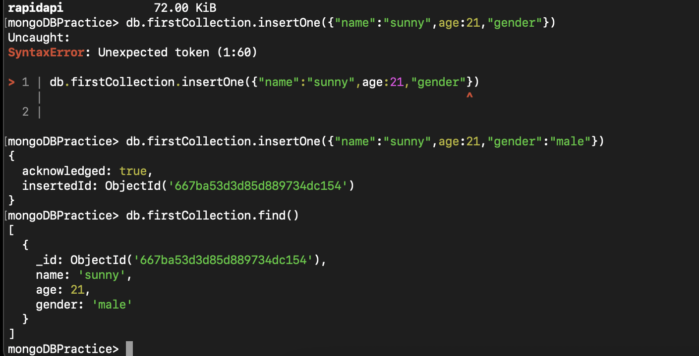
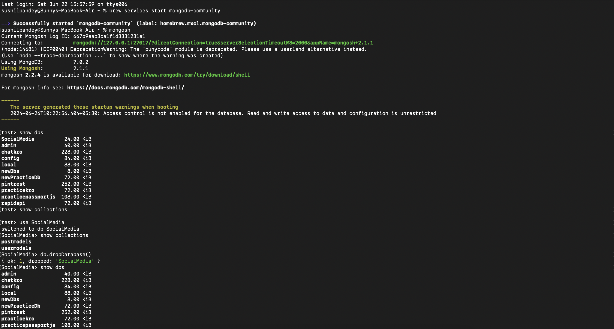
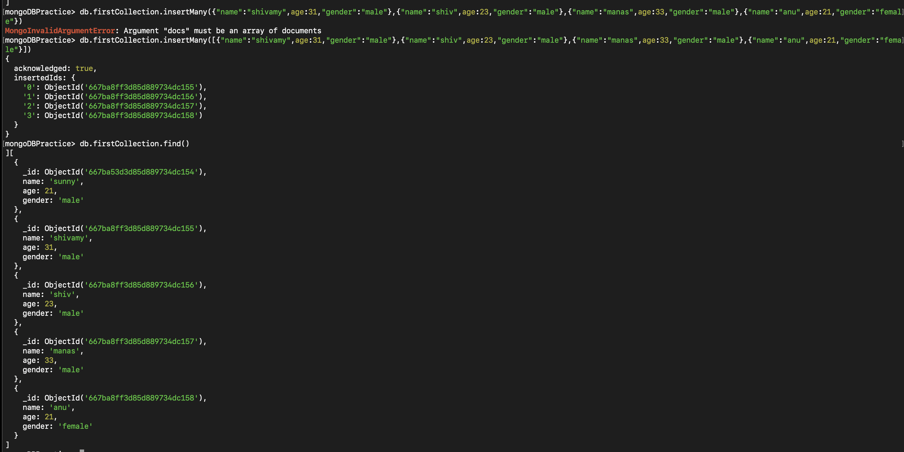
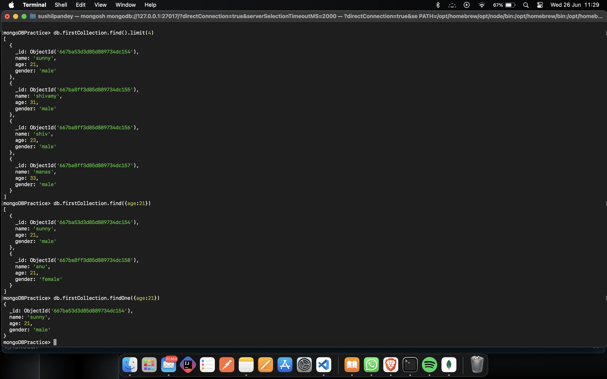

# MongoDB community server:

If you are using the windows system then the mongoDB community server is already started when the mongodb community is installed but if you are a mac user then you need to start the mongoDB community server using the command.

```bash
brew services start mongodb-community
```

then Start the mongoDB shell using :

```bash
mongosh
```

Start interacting with the following commands:

```bash
show dbs  //to show all the data base

use "db-name" //to create a new DB or move to a db

show collections //to show the collections of a DB

db.createCollection("name") //to create a new collection in DB

db.name.drop() //to delete the drop thing

db.dropDatabase() //to delete the DB
```

- you will see the DB in the list of the output of the show dbs command until the db has atleast one collection or insert any document into the Db a collection is automatically created.

## Below is the example of the above:



## CRUD OPERATION IN DB

## - Inserting Documents in MongoDB:

1. To Insert one document
   db.`<collection-name>.insertOne({field1:value1,field2:value2 })`

   
2. To Insert more than one document :
   db.`<collection-name>.insertMany([ {.....}, {......}]) `

   

## - Reading Document in MongoDB:

For retriving information from the mongoDB we use find method from.


